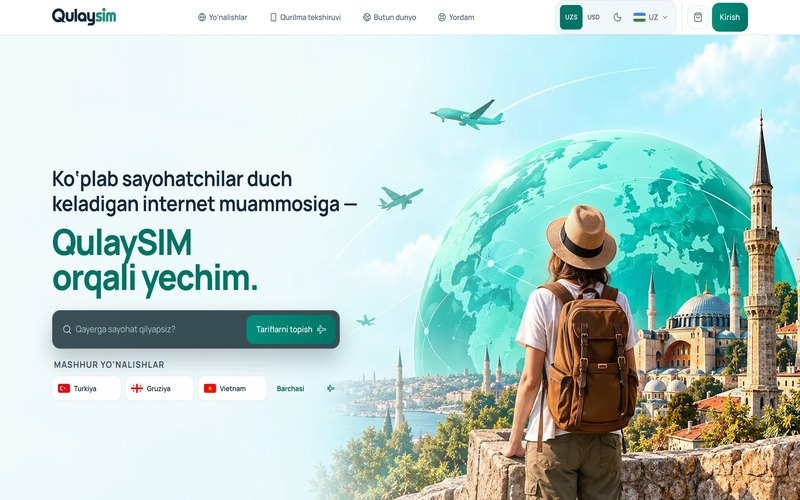
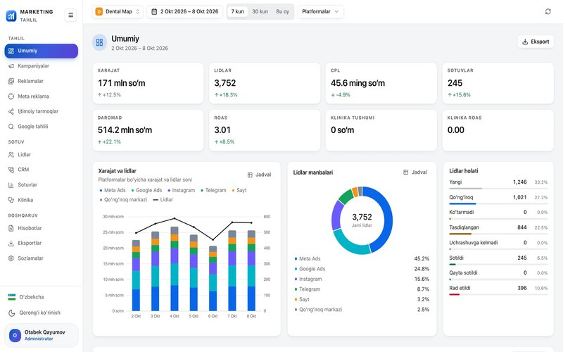
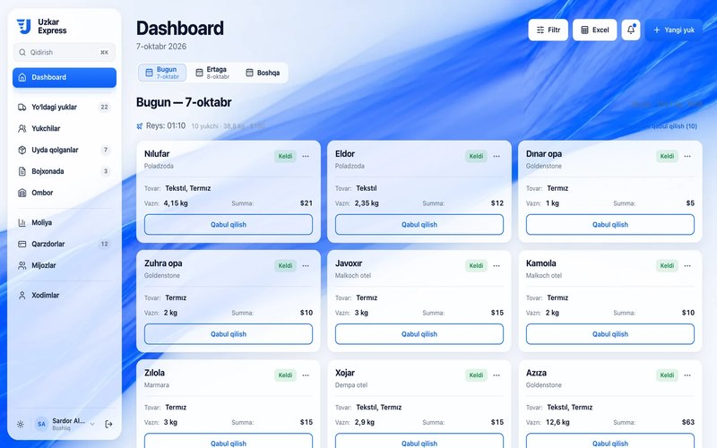
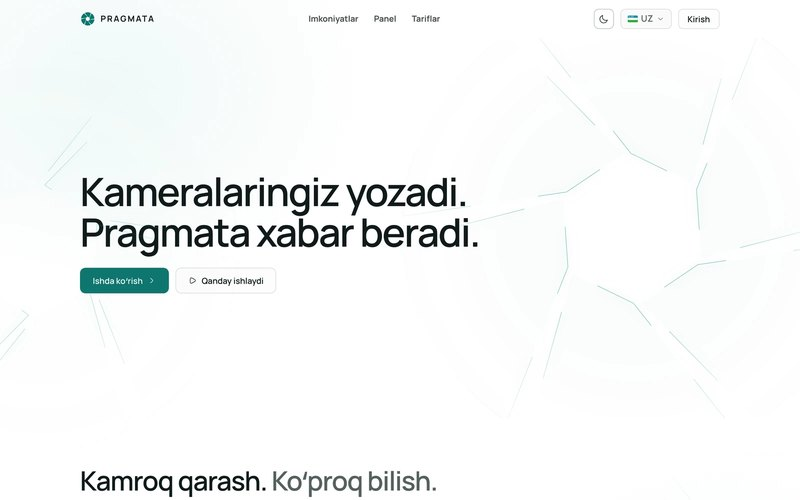
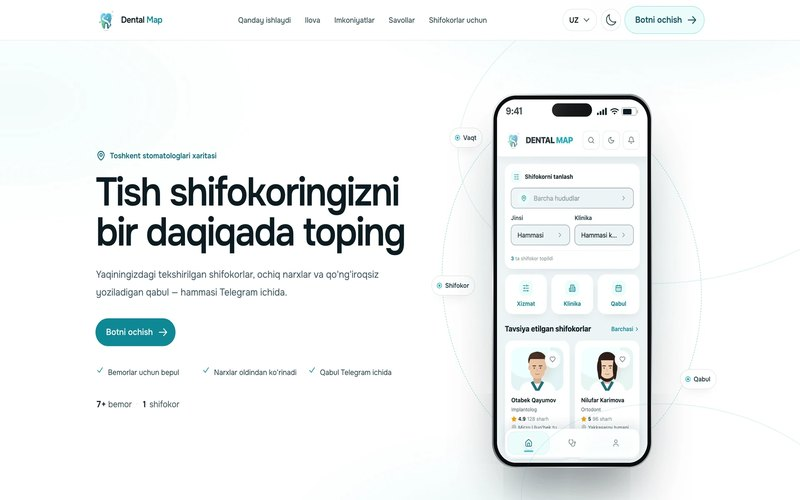
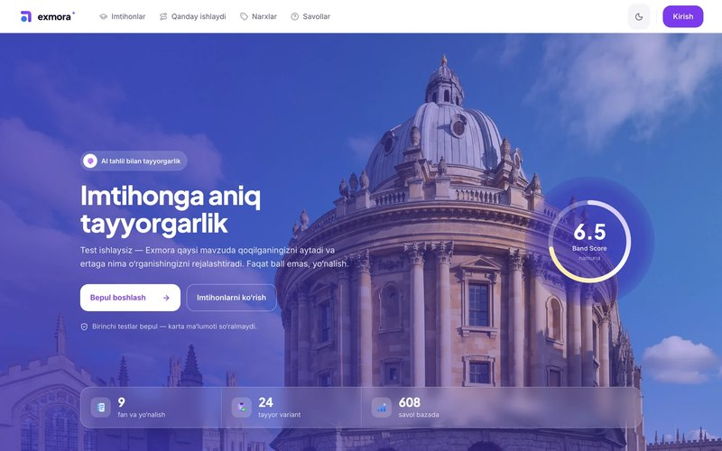

<picture>
  <source media="(prefers-color-scheme: dark)" srcset="assets/banner-dark.svg">
  
</picture>

  
  
  
  

Sayt, mobil ilova, Telegram bot va AI yechimlarni boshidan oxirigacha quraman — dizayn, frontend, backend, server va do‘konga chiqarish. Topshirgandan keyin ham qo‘llab-quvvatlayman.

## Tanlangan ishlar

<table>
  <tr>
    <td width="50%" valign="top">
      
       <b>QulaySIM</b> — eSIM platforma
       Sayt, iOS/Android ilova, backoffice, viza xizmati
    </td>
    <td width="50%" valign="top">
      
       <b>Marketing Analytics</b> — CRM tizim
       Reklama, lid va sotuv tahlili
    </td>
  </tr>
  <tr>
    <td width="50%" valign="top">
      
       <b>Uzkar Express</b> — logistika tizimi
       Yuk, qarz va moliya hisobi
    </td>
    <td width="50%" valign="top">
      
       <b>Pragmata</b> — AI video kuzatuv
       Kameralar uchun AI tahlil
    </td>
  </tr>
  <tr>
    <td width="50%" valign="top">
      
       <b>Dental Map</b> — sayt va Telegram Mini App
       Stomatolog topish va qabul
    </td>
    <td width="50%" valign="top">
      
       <b>Exmora</b> — imtihon va AI test platformasi
       IELTS, SAT va milliy sertifikat mock testlari
    </td>
  </tr>
</table>

<a href="https://otabek-qayumov.uz/loyihalar">Barcha loyihalar →</a>

## Faollik

<picture>
  <source media="(prefers-color-scheme: dark)" srcset="https://raw.githubusercontent.com/otabekqayumov762-collab/otabekqayumov762-collab/output/github-contribution-grid-snake-dark.svg">
  
</picture>

Ishlarning aksariyati mijozlar uchun yopiq repolarda.
